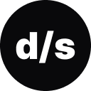

  

<h2 align="center">
Dev Store | A sua loja dev
</h2>

  
  
  
  

 

## Sobre

Projeto desenvolvido na plataforma Rocketseat que introduz os conceitos do framework Next Js, e aprofunda suas recentes funcionalidades a partir da versão 13. 

### Temas abordados
- Uso de client e server components
- App router
- Pages/Layouts
- Loading UI
- Route API
- Testes e2e com Cypress

